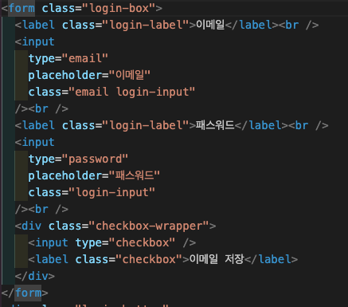
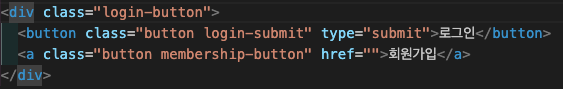
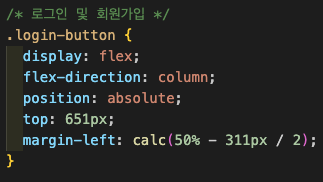
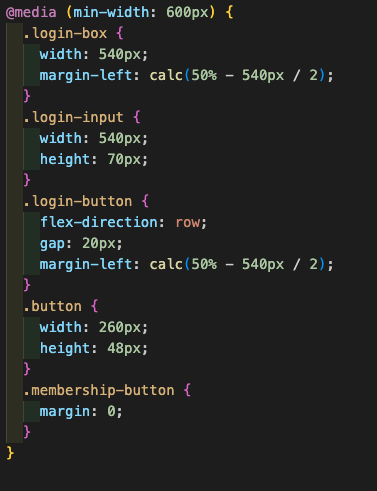

<h2>html makrup</h2>

로그인&환영인사 문구는 login-text, login-header, ediya-coffee
이렇게 3번 나누어 묶었습니다.

이메일&패스워드 창
login-box로 하나로 묶고
label = login-label, input = 각각 login-input
email input은 따로 email로 하나 더 해놨습니다.

로그인&회원가입 버튼
login-button로 하나로 묶고
button, a = button,
login-submit 이랑 membership-button으로
각각 해주었습니다.

<h2>CSS</h2>

default값을 초기화 해주고
각각 margin으로 중앙을 맞추고
max-width 600px은
로그인 및 회원가입 버튼을 flex column을 해주고

min-width 600px은
flex row로 정렬해주었다.

